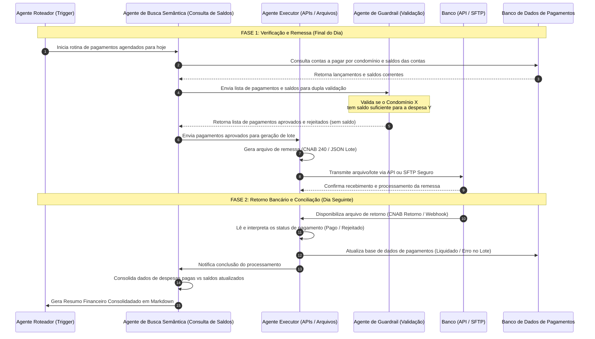

# Caso de Uso Prático: Automação do Ciclo de Pagamentos de Condomínios

Este documento apresenta um exemplo real de como a arquitetura multi-agente do Cérebro de Empresa gerencia e automatiza o fluxo de **Contas a Pagar e Conciliação Bancária** ao final do dia em uma administradora de condomínios.

---

## 🔄 Fluxo de Trabalho de Pagamentos Finais do Dia

O diagrama abaixo ilustra a interação entre os agentes durante as etapas do processo:

---

## 🛠️ Detalhamento das Etapas e Responsabilidades dos Agentes

### Passo 1: Recebimento e Leitura dos Pagamentos Agendados
*   **O que acontece:** Ao final do expediente (ex: 17:00h), o **Agente Roteador** dispara a tarefa automática de conciliação. 
*   **Ação do Agente:** O **Agente de Busca Semântica** lê a tabela de contas a pagar pendentes de hoje no banco de dados corporativo, agrupadas por código de condomínio.

### Passo 2: Validação de Saldos por Condomínio
*   **Regra de Negócio Crucial:** Um condomínio **nunca** pode usar o saldo de outro condomínio para pagar suas contas. O saldo de cada conta bancária do condomínio (ou conta pool segregada) deve ser verificado individualmente.
*   **Ação dos Agentes:**
    1.  O **Agente de Busca Semântica** consulta os saldos bancários atualizados de cada conta de condomínio via API financeira.
    2.  O **Agente de Guardrail** compara a soma dos lançamentos agendados de cada condomínio com o seu saldo disponível.
    3.  **Decisão Automatizada:**
        *   *Saldo Suficiente:* O pagamento é marcado como "Aprovado para Envio".
        *   *Saldo Insuficiente:* O pagamento é retido, e o agente insere um registro de "Alerta de Inadimplência/Sem Saldo" e notifica o gestor financeiro humano.

### Passo 3: Geração e Envio de Arquivos de Remessa (CNAB)
*   **O que acontece:** Criação do lote estruturado de pagamentos para transmissão bancária.
*   **Ação do Agente:** O **Agente Executor de Ações** (Action Agent) aciona um script MCP que compila as informações dos pagamentos aprovados e gera o arquivo de remessa no formato padrão do banco (ex: **CNAB 240** para transferências e boletos de concessionárias).
*   **Transmissão:** O agente faz o upload do arquivo para o servidor SFTP homologado do banco ou transmite os dados via endpoint de lote na API Open Finance da instituição.

### Passo 4: Processamento do Retorno Bancário (Conciliação)
*   **O que acontece:** O banco processa os pagamentos e disponibiliza o arquivo de retorno.
*   **Ação do Agente:** O **Agente Executor de Ações** baixa o arquivo de retorno (CNAB Retorno) do banco. Ele lê linha por linha (registro de transação), identificando:
    *   **Código de Retorno `00`:** Confirmado e pago com sucesso.
    *   **Outros Códigos (ex: `08`, `09`):** Rejeitado (ex: erro na agência/conta do favorecido, CPF/CNPJ inválido).

### Passo 5: Atualização das Bases de Dados
*   **Ação do Agente:** O **Agente Executor** atualiza o banco de dados da administradora:
    *   Muda o status do lançamento de `Agendado` para `Pago` ou `Rejeitado pelo Banco`.
    *   Salva a data da liquidação, valor tarifário bancário cobrado e código de autenticação da transação.

### Passo 6: Criação do Resumo Financeiro das Operações
*   **O que acontece:** Apresentação dos resultados consolidados da operação do dia.
*   **Ação do Agente:** O **Agente de Busca Semântica** compila os resultados e apresenta uma nota gerencial clara e legível ao time financeiro.

---

## 📈 Exemplo Prático de Resumo Financeiro Gerado pelo Agente

Abaixo está o modelo de relatório gerado ao final do processo:

> ### 📝 Relatório Consolidado de Pagamentos - 03/08/2026
>
> **Status Geral do Lote:** Processamento Concluído com Sucesso.
> 
> #### 📊 Resumo Executivo
> *   **Total Solicitado:** R$ 150.000,00 (50 lançamentos)
> *   **Total Pago com Sucesso:** R$ 135.000,00 (45 lançamentos)
> *   **Total Rejeitado por Saldo Insuficiente:** R$ 12.000,00 (4 lançamentos)
> *   **Total Rejeitado por Erro Cadastral:** R$ 3.000,00 (1 lançamento)
>
> ---
> 
> #### ⚠️ Ocorrências e Detalhes
>
> | Condomínio | Favorecido | Valor | Motivo da Rejeição | Ação Recomendada |
> | :--- | :--- | :--- | :--- | :--- |
> | **Condomínio Vista Bella** | Elevadores S/A | R$ 8.000,00 | Saldo Insuficiente na Conta do Condomínio | Apenas R$ 2.000,00 em conta. Aportar fundos ou postergar. |
> | **Condomínio Parque Club** | Pinturas Silva Ltda | R$ 4.000,00 | Saldo Insuficiente na Conta do Condomínio | Cobrança retida para o dia seguinte. |
> | **Condomínio Grand Tower** | Distribuidora Água | R$ 3.000,00 | Erro Cadastral (Dígito de Conta Inválido) | Corrigir dados bancários do favorecido no cadastro. |
> 
> *Relatório gerado automaticamente pelo **Cérebro de Empresa** às 18:30h.*
