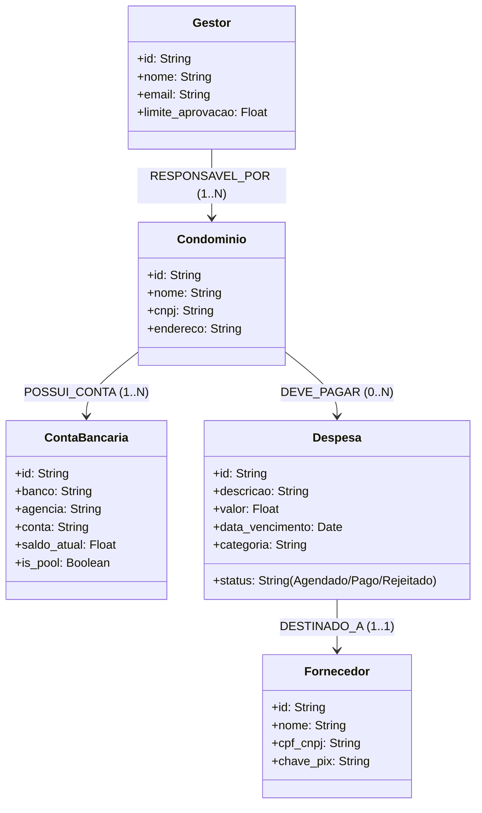

# Modelagem do Grafo de Conhecimento (Knowledge Graph)

Este documento descreve a ontologia semântica do **Cérebro de Gestão de Condomínios**, mapeando nós, relacionamentos e propriedades para habilitar consultas complexas pelo **KBQueryAgent** (Agente de Busca Semântica).

---

## 📐 Esquema do Grafo (Ontologia)

O Grafo de Conhecimento conecta entidades operacionais e dados financeiros, garantindo isolamento de contexto e facilitando o GraphRAG.



---

## 🔗 Detalhamento dos Relacionamentos

### 1. `(:Condominio)-[:POSSUI_CONTA]->(:ContaBancaria)`
*   **Significado:** Mapeia quais contas correntes pertencem juridicamente a qual condomínio.
*   **Regra Semântica:** O Cérebro de Empresa usa esse relacionamento para buscar o saldo disponível *apenas* na conta conectada ao condomínio devedor da despesa.

### 2. `(:Condominio)-[:DEVE_PAGAR]->(:Despesa)`
*   **Significado:** Liga a obrigação financeira de pagamento ao respectivo condomínio.
*   **Propriedades da Aresta:** `competencia` (Mês/Ano), `urgente` (Boolean).

### 3. `(:Despesa)-[:DESTINADO_A]->(:Fornecedor)`
*   **Significado:** Associa a despesa ao favorecido final do pagamento.
*   **Utilidade:** Fornece os dados bancários/chave Pix do fornecedor para geração do arquivo de remessa CNAB.

### 4. `(:Gestor)-[:RESPONSAVEL_POR]->(:Condominio)`
*   **Significado:** Define a matriz de autoridade. O Cérebro de Empresa usa isso para direcionar alertas de falta de saldo ou solicitar aprovação humana.

---

## 🔍 Exemplo de Consultas Cypher (GraphRAG / Neo4j)

Abaixo estão consultas que o **KBQueryAgent** pode rodar de forma autônoma para obter o contexto operacional:

### A. Verificar saldo vs. contas a pagar hoje por condomínio
```cypher
MATCH (c:Condominio)-[:POSSUI_CONTA]->(cb:ContaBancaria)
MATCH (c)-[:DEVE_PAGAR]->(d:Despesa)
WHERE d.data_vencimento = date() AND d.status = "Agendado"
RETURN c.nome AS Condominio, 
       cb.saldo_atual AS SaldoDisponivel, 
       sum(d.valor) AS TotalAPagar, 
       cb.saldo_atual >= sum(d.valor) AS PossuiSaldoSuficiente
```

### B. Obter dados de pagamento e favorecido para geração do CNAB (Remessa)
```cypher
MATCH (c:Condominio)-[:DEVE_PAGAR]->(d:Despesa)-[:DESTINADO_A]->(f:Fornecedor)
WHERE d.id = $despesaId
RETURN c.nome AS Condominio,
       d.valor AS Valor, 
       d.descricao AS Descricao,
       f.nome AS Favorecido, 
       f.cpf_cnpj AS Documento, 
       f.chave_pix AS ChavePix
```
