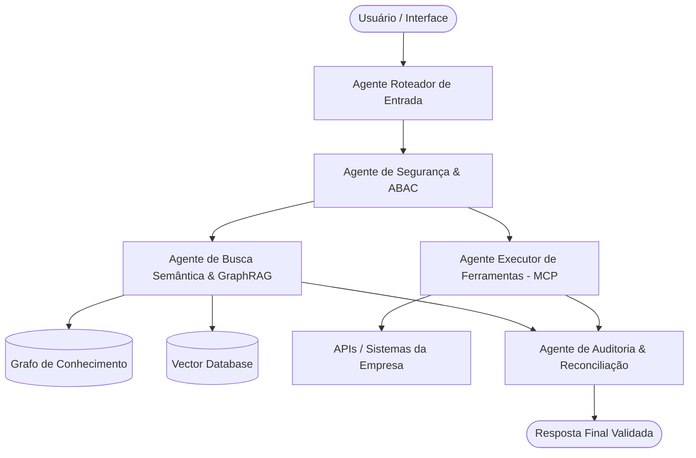

# Modelo de Agentes para o Cérebro de Empresa

Este documento especifica a arquitetura multi-agente recomendada para processar os ativos coletados e governar as interações no Cérebro de Empresa. Cada agente possui escopo delimitado para otimizar a eficiência de contexto e reduzir alucinações.

---

## 🏗️ Arquitetura Multi-Agente (Orquestração Cognitiva)

Para evitar sobrecarga de contexto e garantir conformidade com as regras de negócio da empresa, dividimos as responsabilidades em cinco agentes especializados:

---

## 🤖 Definição de Papéis dos Agentes

### 1. Agente Roteador (Router Agent)
*   **Objetivo:** Interceptar a solicitação do usuário e decidir qual fluxo de trabalho ou skill deve ser ativado.
*   **Entradas consumidas:** Pergunta do usuário e histórico de sessão recente.
*   **Como opera:** Utiliza classificadores leves baseados nas tags e descrições das Skills (ex: `enterprise-brain-architect`) para direcionar a tarefa sem carregar todas as regras corporativas de uma vez.

### 2. Agente de Busca Semântica (GraphRAG & Knowledge Agent)
*   **Objetivo:** Recuperar fatos, relacionamentos estruturados e documentos para responder a dúvidas do usuário.
*   **Entradas consumidas:**
    *   Arquivos brutos processados (do diagnóstico de coleta).
    *   Esquema de Ontologia da Camada Semântica.
*   **Ações:** Realiza buscas híbridas (Vetorial + Grafo de Conhecimento) e monta o contexto factual consolidado.

### 3. Agente Executor de Ações (Tool/Action Agent)
*   **Objetivo:** Interagir com sistemas legados e executar rotinas de escrita ou consultas dinâmicas em APIs corporativas via Model Context Protocol (MCP).
*   **Entradas consumidas:** Documentação OpenAPI/Swagger coletada e playbooks de processos da empresa.
*   **Ações:** Gera payloads de API, executa chamadas e valida retornos de sucesso/erro.

### 4. Agente de Segurança e Guardrail (Guardrail Agent)
*   **Objetivo:** Garantir a conformidade das perguntas de entrada e respostas de saída em relação a permissões e políticas da empresa.
*   **Entradas consumidas:** 
    *   Matriz de Controle de Acesso (RBAC/ABAC).
    *   Políticas de LGPD e segurança de dados coletadas.
*   **Ações:** Bloqueia tentativas de prompt injection, oculta PII (dados pessoais sensíveis) e valida se o nível de privilégio do usuário logado é compatível com os dados retornados pelo RAG.

### 5. Agente de Avaliação Continuada (Eval/Judge Agent)
*   **Objetivo:** Medir a qualidade de todas as interações e atuar em ambiente de homologação testando novas versões do cérebro.
*   **Entradas consumidas:** **Golden Dataset** (Queries, Contextos Simulados, Ground Truths e Métricas RAGAS).
*   **Ações:** Roda testes em lote automáticos (CI/CD) gerando relatórios de Fidelidade (*Faithfulness*) e Acurácia de Seleção de Ferramentas.

---

## 🛠️ Regras de Engenharia de Contexto para os Agentes

Ao construir as diretrizes dos agentes na prática, aplique sempre o princípio de **Divulgação Progressiva**:
1.  **Defina as Regras de Ação fora do Agente:** Em vez de instruir o `ActionAgent` com todas as regras de reembolso da empresa em seu prompt principal, salve essas regras em um arquivo como `references/reimbursement_policy.md` e ensine o agente a consultar esse arquivo por demanda.
2.  **Use Schemas estritos para Retornos:** Garanta que todas as interações entre os agentes sigam contratos JSON estruturados, facilitando testes e evitando quebras nos pipelines operacionais.
3.  **Audite os Traces de Execução:** Grave todas as decisões de roteamento e ferramentas escolhidas pelo `RouterAgent` e `ActionAgent` para enriquecer continuamente o **Golden Dataset**.
